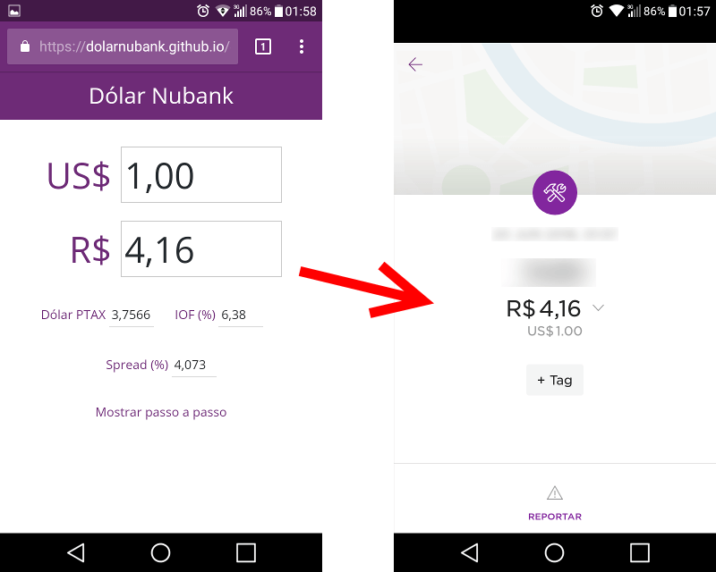

# Dólar do Nubank

O objetivo do site [dolarnubank.github.io](https://dolarnubank.github.io)
é calcular o valor aproximado que vai aparecer na fatura quando for feita
uma compra internacional usando o cartão de crédito do Nubank.

A seguir temos duas fórmulas. A primeira, que é justamente usada nesse site,
mostra como calcular o valor na fatura considerando o valor da compra em dólares
e a cotação atual do dólar PTAX que aparece no site do Banco Central.

O Nubank afirma que o spread é de 4%, no entanto essa porcentagem varia
todo dia, segundo um critério desconhecido, chegando a 4,3% ou mais. A segunda
fórmula permite calcular o valor exato do spread considerando o valor que
aparece na fatura, a cotação do dólar PTAX e o valor da compra em dólares.

---

## Cálculo do dólar do Nubank

    Seja:
        C: o valor da compra em dólares
        P: o valor do dólar PTAX para venda (ver em www.bcb.gov.br)
        V: o valor final na fatura incluindo o IOF
        S: o spread (4% segundo o Nubank)

Assim se calcula o valor final na fatura:

    V = 1,0638 * 1,04 * C * P
    V = 1,106352 * C * P

Exemplo:

Foi feita uma compra de US$ 25,00, com dólar PTAX a 3,7566.
Considere o spread de 4,3%. Qual é o valor final na fatura do Nubank?

    V = 1,0638 * 1,043 * C * P
    V = 1,0638 * 1,043 * 25 * 3,7566
    V = 104,202768411

O valor na fatura do Nubank é de R$ 104,20

---

## Cálculo do spread

    Seja
        C: o valor da compra em dólares
        P: o valor do dólar PTAX para venda (ver em www.bcb.gov.br)
        V: o valor final na fatura incluindo o IOF
        S: o spread

Assim se calcula o spread:

    S = (V / (1,0638 * C * P)) - 1

Explicação da fórmula:

- Sem impostos o valor final seria: `V = C * P`

- Adicione o spread: `V = S * C * P`

- Adicione o IOF de 6,38%: `V = 1,0638 * S * C * P`

- Então: `S = V / (1,0638 * C * P)`

`S` vai resultar em algo como 1,04, que representa um aumento de 4%, então
subtraímos 1 da fórmula:

`S = (V / (1,0638 * C * P)) - 1`

Exemplo:

Foi feita uma compra de US$ 25,00, com dólar PTAX a 3,7566. Na fatura do Nubank
aparece o valor final de R$ 104,27. Qual é a porcentagem do spread do Nubank?

    S = (V / (1,0638 * C * P)) - 1
    S = (104,27 / (1,0638 * 25 * 3,7566)) - 1
    S = (104,27 / 99,906777) - 1
    S = 0,0436729432279

O spread é de 4,367%
